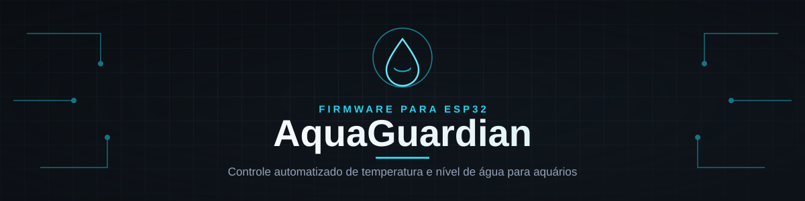
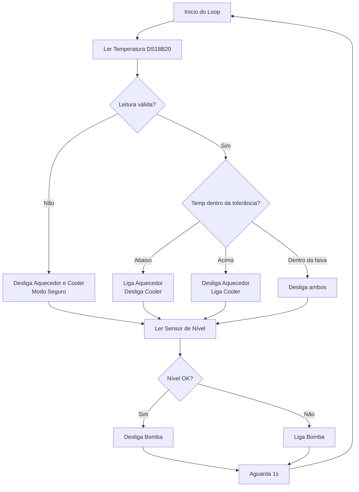

<div align="center">

# 🐠 AquaGuardian

### Firmware de Controle Automatizado para Aquários

*Temperatura estável. Nível sempre em dia. Seus peixes agradecem.* 🐟


</div>

---
<div align="center">
  
</div>

##  Sobre o Projeto

**AquaGuardian** é um firmware para **ESP32** desenvolvido para automatizar o monitoramento e controle de **temperatura** e **nível de água** em aquários, sumps ou reservatórios.

O sistema lê continuamente a temperatura da água através de um sensor **DS18B20** e aciona automaticamente um **aquecedor** ou um **cooler**, mantendo a água dentro de uma faixa de temperatura ideal com uma margem de tolerância configurável. Além disso, monitora o **nível de água** e aciona uma **bomba de reposição** sempre que o nível estiver baixo, evitando que o aquário fique com água insuficiente.

>  O objetivo é simples: **manter o ambiente aquático estável e seguro, mesmo sem supervisão constante.**

<br></br>
---

##  Funcionalidades

| Funcionalidade | Descrição |
|---|---|
|  **Controle de Temperatura** | Liga/desliga aquecedor e cooler automaticamente com base em uma temperatura alvo |
|  **Tolerância Configurável** | Evita chaveamento excessivo dos relés (efeito *liga-desliga* repetitivo) |
|  **Controle de Nível de Água** | Aciona bomba de reposição automaticamente quando o nível está baixo |
|  **Failsafe de Sensor** | Se a leitura de temperatura falhar ou for inconsistente, aquecedor e cooler são desligados por segurança |
|  **Monitoramento via Serial** | Log em tempo real de temperatura, nível e status dos relés |

---

##  Hardware Necessário

-  Placa **ESP32**
-  Sensor de temperatura **DS18B20** (à prova d'água)
-  Resistor **4.7kΩ** (pull-up para o barramento OneWire)
-  Sensor de nível de água (contato/boia)
-  **3x Módulos Relé** (aquecedor, cooler e bomba)
-  Aquecedor de aquário
-  Cooler / ventoinha de refrigeração
-  Bomba de reposição de água

---

## Mapeamento de Pinos

| Pino ESP32 | Componente | Observação |
|:---:|---|---|
| `GPIO 18` | Sensor DS18B20 (Data) | 
| `GPIO 26` | Sensor de Nível | GND e Pino (usa `INPUT_PULLUP`) |
| `GPIO 33` | Relé da Bomba | Aciona reposição de água |
| `GPIO 23` | Relé do Aquecedor | Aquecimento da água |
| `GPIO 22` | Relé do Cooler | Resfriamento da água |

> ⚠️ **Atenção:** os relés utilizados neste firmware são ativados em **nível lógico `LOW`** (relés ativos em baixa). Verifique a compatibilidade do seu módulo antes de energizar o sistema.

<br></br>
##  Como Funciona



###  Lógica de Temperatura

O firmware trabalha com uma **temperatura alvo** (`temp_media`) e uma **margem de tolerância** (`tolerancia`):

```cpp
float temp_media = 27;     // Temperatura ideal (°C)
float tolerancia = 0.5;    // Margem de segurança (±°C)
```

- Se `temp <= temp_media - tolerancia` →  **Aquecedor liga**
- Se `temp >= temp_media + tolerancia` →  **Cooler liga**
- Se estiver dentro da faixa →  **Ambos desligados**
- Se a leitura for inválida (sensor desconectado ou fora de `0–60°C`) →  **Modo seguro**, ambos desligados

###  Lógica de Nível de Água

- Nível **baixo** →  Bomba **liga** para repor água
- Nível **correto** → Bomba **desliga**

---

##  Bibliotecas Necessárias

Instale as seguintes bibliotecas pela **Arduino IDE** (Gerenciador de Bibliotecas) ou **PlatformIO**:

```
OneWire
DallasTemperature
```

---

##  Instalação

1. Clone este repositório:
   ```bash
   git clone https://github.com/Pedro-Wilson/Firmware-Aquaguard.git
   ```
2. Abra o arquivo `.ino` na **Arduino IDE**.
3. Instale as placas **ESP32** no *Boards Manager*, caso ainda não tenha.
4. Instale as bibliotecas `OneWire` e `DallasTemperature`.
5. Selecione a placa correta em **Ferramentas > Placa > ESP32**.
6. Conecte o hardware conforme o [mapeamento de pinos](#-mapeamento-de-pinos).
7. Faça o upload do firmware para o ESP32.
8. Abra o **Monitor Serial** em `115200 baud` para acompanhar os logs.

---

## Configuração Rápida

Ajuste os valores no topo do código conforme a necessidade do seu aquário:

```cpp
float temp_media = 27;     //  Altere para a temperatura ideal da sua espécie
float tolerancia = 0.5;    //  Ajuste a sensibilidade do controle
```
---

<div align="center">

**Feito com 💙 para manter aquários seguros e estáveis**

⭐ Se este projeto te ajudou, considere deixar uma estrela!

</div>
